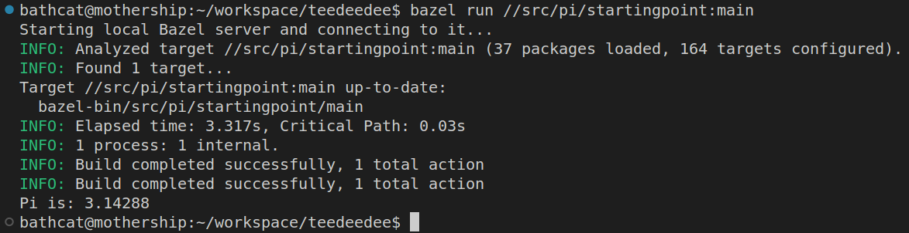

# Test-Driven Development (TDD)


Learn how to define the iterative and quality-focused software development methodology of TDD.

---

## Contents

* [Overview](#overview)
* [Outline](#outline)
* [Setup](#setup)

---

## Overview
The Test-Driven Development training course demonstrates how it can be used to create high quality software.

The course begins with an examination of common test terminologies, practices, benefits, and pitfalls. The course then moves into a discussion on the theory and practice of Test-Driven Development (TDD). It also covers the applicability of TDD in modern software development paradigms, and how it can be leveraged within different software engineering processes. Once the foundation has been laid, the TDD course transitions into a hands-on learning lab.

Finally, students learn the processes and practices of TDD in the creation of a basic application.

<br/>

### Objectives
After this course, you will be able to:
* Identify software testing concepts
* Describe the testing process
* Evaluate and implement test-driven development 
* Devise a test-driven development infrastructure
* Define and execute a test plan using a testing framework
* Research the continuous and integration testing tool
* Incorporate TDD into your organization

<br/>

### Duration
This course will be delivered in 2 days

<br/>

---

## Outline

* What is TDD?
  - Why Adopt TDD
  - Benefits of TDD
  - Test Plans, Cases, and Suites
  - Unit Testing
  - Integration Testing
  - Continuous Testing

* TDD Concepts
  - Where to Begin TDD
  - TDD Patterns
  - TDD Best Practices

* Testing Tools
  - Unit and Integration Testing
  - Automated Testing
  - Continuous Testing
  - Code Coverage Analysis
  - Google Test & Alternatives
  - Creating Unit Tests
  - Creating Integration Tests

* Dependencies
  - Mocks v. Stubs
  - Creating Mocks
  - Best practices
  - Replacing Mock Objects With Live Objects

* Testing Legacy Code
  - What is Refactoring?
  - Concepts and Best Practices
  - Common Approaches
  - Exploring Dependencies
  - Creating Loose Coupling

* Testing Infrastructure
  - What is CI?
  - Incorporating Tests Into the CI Environment
  - Build Systems
  - Reporting

* How to Adopt TDD
  - Infrastructure Changes Required
  - Adoption Planning
  - Measuring and Monitoring Adoption
  - Adjustments

---

## Setup

Everything works with Bazel and GCC-- any recent version of either should be fine. But there's not much magic, so-- if you insist-- can easily set up some cmake files or just use **gcc** from the terminal.

#### Chose one of the options below. Then, to test that your setup is working:
1. Open a terminal
2. Navigate to the repository
3. Run some arbitrary project like this:
```shell
bazel run //src/pi/startingpoint:main
```

If everything works right, you'll see something like this:


<br/>
<br/>

### Option 1: Github CodeSpaces

With just a free account, you can run VSCode (or some version thereof) with Docker in your browser.

#### Advantages
* Zero installation

#### Disadvantages
* Takes a *while* to download container images
* Free version limits time an space
* It's a hassle to view artifacts-- e.g. test coverage reports

#### Steps:
1. In a browser, navigate to https://github.com/bathcat/teedeedee
2. Click **Code** > **Codespaces** > **Create codespace on main**


<br/>
<br/>


### Option 2: Docker (with VSCode)

Docker abstracts all software requirements, and VSCode works really well with containers. Read up on [Developing Inside a Container](https://code.visualstudio.com/docs/devcontainers/containers)

#### Advantages
* Less configuration
* Repeatable environment setup
* Artifacts live on your local filesystem

#### Disadvantages
* Takes a *while* to set up the environment
* You need Docker
* If your favorite editor *isn't* VSCode, you'll need to play around getting that set up

#### Tools
1. [Docker](https://www.docker.com/get-started/)
2. [VSCode](https://code.visualstudio.com/)
3. [Remote Development extension pack](https://marketplace.visualstudio.com/items?itemName=ms-vscode-remote.vscode-remote-extensionpack)

#### Steps
1. Clone repo
2. Open in VSCode
3. **F1** > **Dev Containers: Reopen in Container**


<br/>
<br/>


### Option 3: On the Metal
There's nothing magical about this setup: it's GCC with Bazel and a couple less-important bits for debugging and code coverage. So if you don't want to mess with containers, that's ok too.

#### Advantages
* Everything is local
* No messing with containers
* Use your favorite IDE
* No time wasted downloading container images

#### Disadvantages
* I only tested this on Linux
* Weird stuff might happen if our versions are different

#### Tools
1. [Bazel](https://bazel.build/start)
2. [GCC](https://gcc.gnu.org/)
3. **lcov** and **gdb** -- e.g. `> sudo apt-get update && apt-get install lcov gdb`

#### Steps
1. Clone repo
2. Open in your favorite editor
