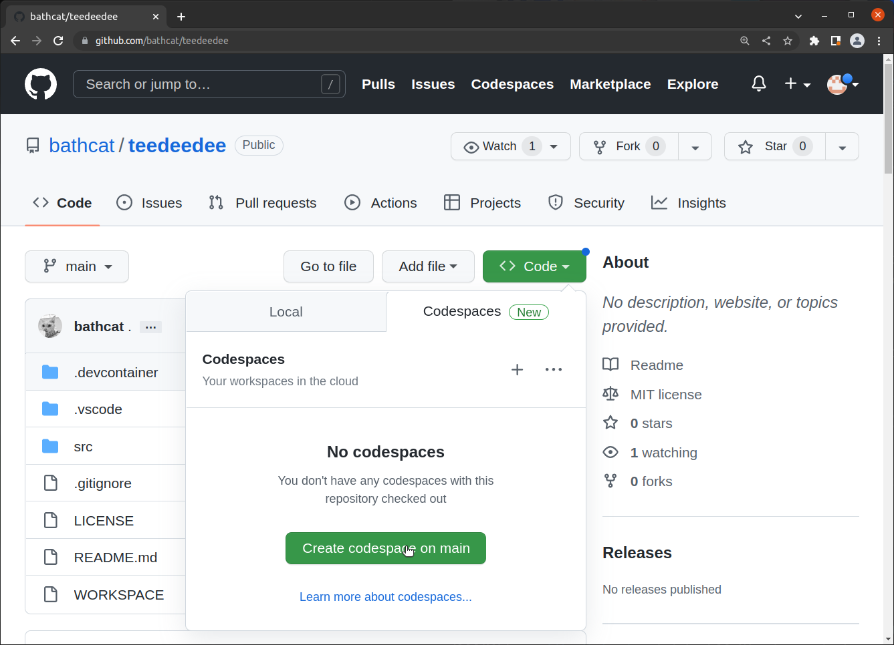
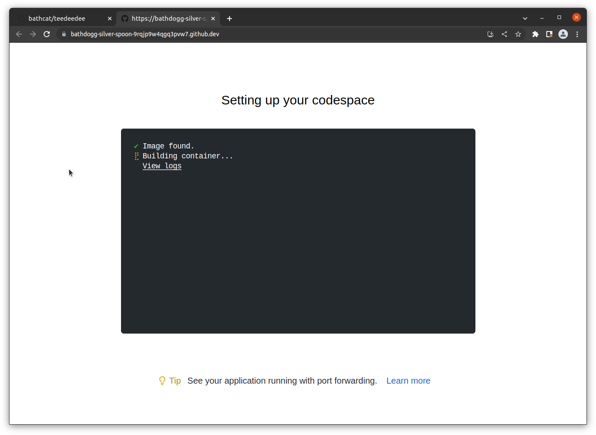
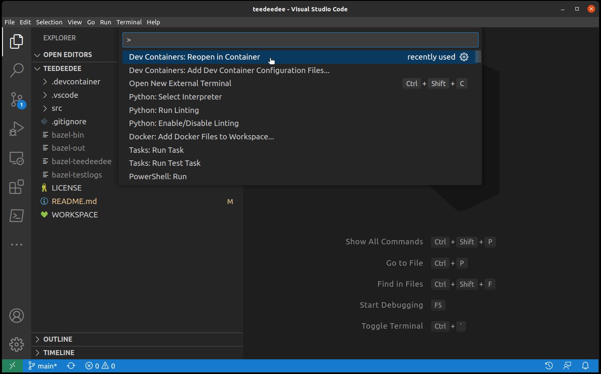

# Test-Driven Development (TDD)


Learn how to define the iterative and quality-focused software development methodology of TDD.

---

## Contents

* [Overview](#overview)
* [Outline](#outline)
* [Setup](#setup)

---

## Overview
The Test-Driven Development training course demonstrates how it can be used to create high quality software.

The course begins with an examination of common test terminologies, practices, benefits, and pitfalls. The course then moves into a discussion on the theory and practice of Test-Driven Development (TDD). It also covers the applicability of TDD in modern software development paradigms, and how it can be leveraged within different software engineering processes. Once the foundation has been laid, the TDD course transitions into a hands-on learning lab.

Finally, students learn the processes and practices of TDD in the creation of a basic application.

<br/>

### Objectives
After this course, you will be able to:
* Identify software testing concepts
* Describe the testing process
* Evaluate and implement test-driven development 
* Devise a test-driven development infrastructure
* Define and execute a test plan using a testing framework
* Research the continuous and integration testing tool
* Incorporate TDD into your organization

<br/>

### Duration
This course will be delivered in 2 days

<br/>

---

## Outline

* What is TDD?
  - Why Adopt TDD
  - Benefits of TDD
  - Test Plans, Cases, and Suites
  - Unit Testing
  - Integration Testing
  - Continuous Testing

* TDD Concepts
  - Where to Begin TDD
  - TDD Patterns
  - TDD Best Practices

* Testing Tools
  - Unit and Integration Testing
  - Automated Testing
  - Continuous Testing
  - Code Coverage Analysis
  - Google Test & Alternatives
  - Creating Unit Tests
  - Creating Integration Tests

* Dependencies
  - Mocks v. Stubs
  - Creating Mocks
  - Best practices
  - Replacing Mock Objects With Live Objects

* Testing Legacy Code
  - What is Refactoring?
  - Concepts and Best Practices
  - Common Approaches
  - Exploring Dependencies
  - Creating Loose Coupling

* Testing Infrastructure
  - What is CI?
  - Incorporating Tests Into the CI Environment
  - Build Systems
  - Reporting

* How to Adopt TDD
  - Infrastructure Changes Required
  - Adoption Planning
  - Measuring and Monitoring Adoption
  - Adjustments

---

## Setup

Everything works with Bazel and GCC, but whatever you want to use is fine.

To test:
```shell
bazel run //src/pi/startingpoint:main
```

### Github Spaces

Lorem ipsum dolor sit amet, consectetur adipiscing elit. Etiam quis volutpat dolor. Suspendisse quis scelerisque nisl. Vestibulum dapibus scelerisque justo, non malesuada orci luctus at. 



<br/>

### Docker (with VSCode)

Lorem ipsum dolor sit amet, consectetur adipiscing elit. Etiam quis volutpat dolor. Suspendisse quis scelerisque nisl. Vestibulum dapibus scelerisque justo, non malesuada orci luctus at. 

Read up on [Developing Inside a Container](https://code.visualstudio.com/docs/devcontainers/containers)

1. [VSCode](https://code.visualstudio.com/)
2. [Docker](https://www.docker.com/get-started/)
3. [Remote Development extension pack](https://marketplace.visualstudio.com/items?itemName=ms-vscode-remote.vscode-remote-extensionpack)



<br/>


### On the Metal

1. [Bazel](https://bazel.build/start)
2. [GCC](https://gcc.gnu.org/)
