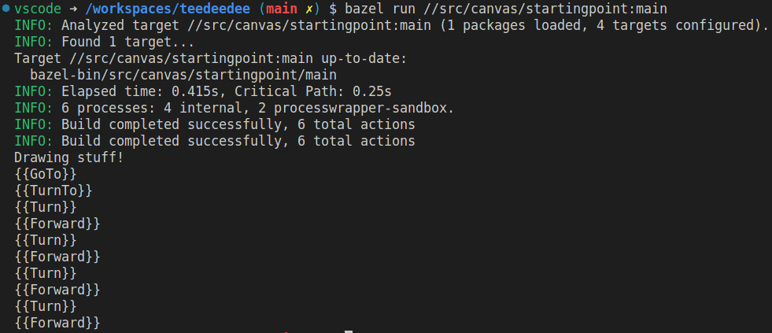

# Lab: Canvas

## Summary

This is a simple command-line application that draws some things using a third-party [Turtle](https://en.wikipedia.org/wiki/Turtle_graphics) graphics library. It's a 
common example used in the **GMock** documentation. This implementation is inspired by the Web API [**CanvasRenderingContext2D**](https://developer.mozilla.org/en-US/docs/Web/API/CanvasRenderingContext2D).

Everything works-- such as it is-- so you can run the startingpoint application to draw a rectangle and get output like this:

(Pretend like it's drawing a rectangle.)

 

**The problem** is that the current implementation is tightly coupled to the 3rd party turtle library, 
making it hard to unit test. Additionally, the tight coupling would make it harder to switch to a different
library in the future.

 

## Requirements

1. Refactor to reduce coupling
2. Add unit tests

