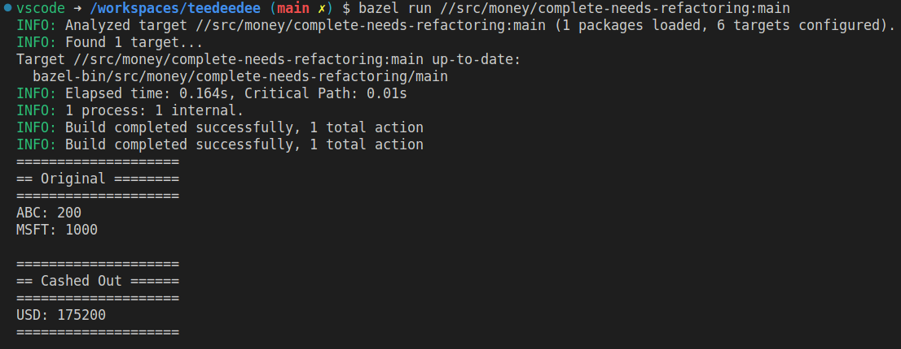

# Money

## Summary

This is a classic scenario that Kent Beck uses to demonstrate the practice of 
Test Driven Development. It models a financial application that converts between
currencies based on current exchange rates.

## Details

 

Suppose we have a report like this:

| Asset      | Quantity | Price | Total   |
|------------|---------:|------:|--------:|
| MSFT       | 1000     | 95    | 95000   |
| XYZ        | 200      | 100   | 200000  |
|            |          | Total | 295000  |

 

To make a multi-currency report, we need to add currencies:

| Asset      | Quantity | Price   | Total      |
|------------|---------:|--------:|-----------:|
| MSFT       | 1000     | 95 USD  | 95000 USD  |
| NOK        | 200      | 100 EUR | 200000 EUR |
|            |          | Total   | ??????     |

 
We also need to specify exchange rates:

| From  | To    | Rate  | 
|-------|-------|------:|
| USD   | EUR   | 1.10  | 
| EUR   | USD   | 0.87  | 

 

From Kent Beck:
> What behavior will we need to produce the revised report? Put another way, what
> set of tests, when passed, will demonstrate the presence of code we are confident
> will compute the report correctly?
> 
> We need to be able to add amounts in two different currencies and convert the
> result given a set of exchange rates. We need to be able to multiply an amount 
> (price > per share) by a number (number of shares) and receive an amount.

 

## Goals

The real goal here is to experiment strict textbook TDD. So: make sure to practice the small steps--
as small as possible:

1. Write a test
2. Make it run
3. Make it right

It's ok if this feels weird; you don't have to code this way for the rest of your life.

 

## Requirements

1. **Represent a fungible asset that supports addition.** So `5USD + 5USD == 10USD` and `5EUR + 5EUR == 10EUR`. But it should be impossible to directly add assets of differing denominations.
2. **Represent a collection of different non-fungible assets.** e.g. **5USD, 15EUR, 25MSFT**
3. **Enable conversion between assets of different denominations.**

 

Since the point of this exercise is TDD, your actual output doesn't matter to much. Just take small steps
and make sure you have decent test coverage. 

Here's a sample report showing an original portfolio that 
gets converted into cash:

