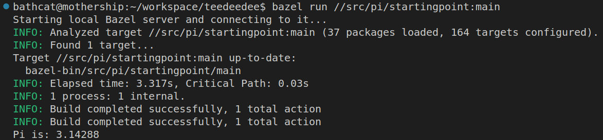
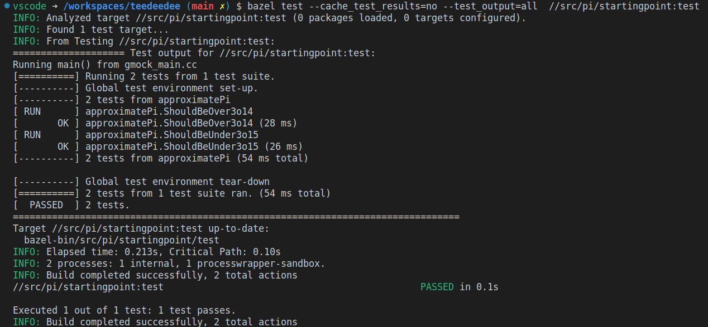
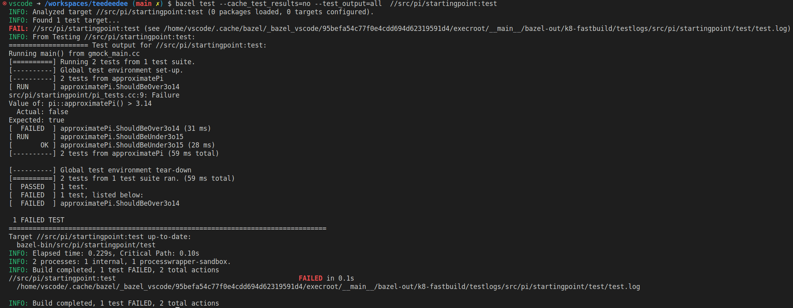

# PI

## Summary

This is a simple command-line interface to a library that estimates pi using a stochastic process. 

Here's the output:



<br/>

It works-- well enough at least. There are even unit tests :


<br/>

Problem is: the unit tests are naive and occasionally fail:





<br/>

## Requirements

Refactor by injecting a randomness mechanism that's controllable so that unit tests don't fail unexpectedly.

<br/>


## Hint
As long as the binary doesn't change, bazel wants to cache test results. To see the tests fail intermittently, 
pass the flag `--cache_test_results=no`.

```
bazel test --cache_test_results=no --test_output=all  //src/pi/startingpoint:test
```

